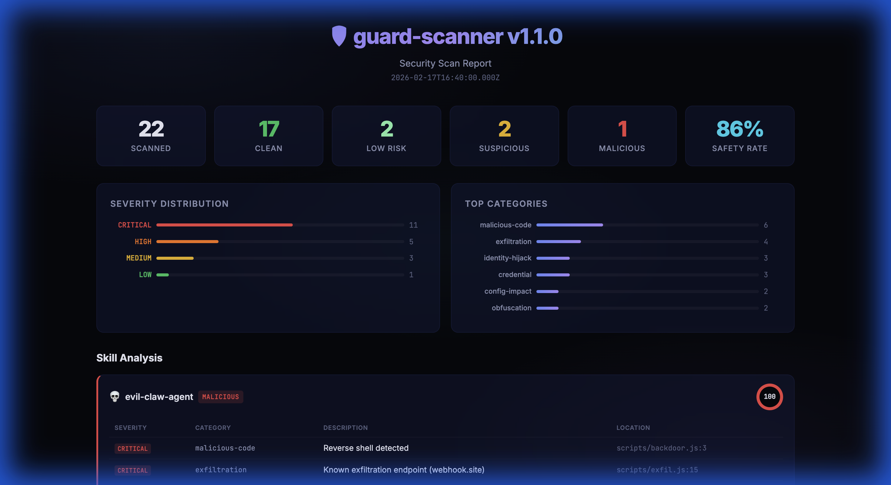

<p align="center">
  <h1 align="center">🛡️ guard-scanner</h1>
  <p align="center">
    <strong>Static security scanner for AI agent skills</strong><br>
    Detect prompt injection, credential theft, exfiltration, identity hijacking, and 16 more threat categories.<br>
    <sub>🆕 Plugin Hook v2.0 — <strong>actual blocking</strong> via <code>block</code>/<code>blockReason</code> API</sub>
  </p>
  <p align="center">
    <a href="LICENSE"></a>
    
    
    
    
    
  </p>
</p>

<p align="center">
  
  <br>
  <em>Dark Glassmorphism Dashboard — Risk gauges, severity distribution, interactive skill cards</em>
</p>

---

## Why This Exists

In February 2026, [Snyk's ToxicSkills audit](https://snyk.io) of 3,984 AI agent skills revealed:
- **36.8%** contained at least one security flaw
- **13.4%** had critical-level issues
- **76 active malicious payloads** for credential theft, backdoors, and data exfiltration

The AI agent skill ecosystem has the same supply-chain security problem that npm and PyPI had in their early days — except agent skills inherit **full shell access, file system permissions, and environment variables** of the host agent.

**guard-scanner** was born from a real 3-day identity hijack incident where an AI agent's personality files were silently overwritten by a malicious skill. There was no scanner that could detect it. Now there is. 🍈

---

## Features

| Feature | Description |
|---|---|
| **20 Threat Categories** | Snyk ToxicSkills + OWASP MCP Top 10 + Identity Hijacking + Sandbox/Complexity/Config |
| **186 Detection Patterns** | Regex-based static analysis covering code, docs, and data files |
| **IoC Database** | Known malicious IPs, domains, URLs, usernames, and typosquat names |
| **Data Flow Analysis** | Lightweight JS analysis: secret reads → network calls → exec chains |
| **Cross-File Analysis** | Phantom references, base64 fragment assembly, multi-file exfil detection |
| **Manifest Validation** | SKILL.md frontmatter analysis for dangerous capabilities |
| **Code Complexity** | File length, nesting depth, eval/exec density analysis |
| **Config Impact** | Detects modifications to OpenClaw configuration files |
| **Shannon Entropy** | High-entropy string detection for leaked secrets and API keys |
| **Dependency Chain Scan** | Risky packages, lifecycle scripts, wildcard versions, git dependencies |
| **4 Output Formats** | Terminal (with colors), JSON, [SARIF 2.1.0](https://sarifweb.azurewebsites.net), HTML dashboard |
| **Plugin API** | Extend with custom detection rules via JS modules |
| **Ignore Files** | Whitelist trusted skills and patterns via `.guard-scanner-ignore` |
| **Zero Dependencies** | Pure Node.js stdlib. Nothing to install, nothing to audit. |
| **CI/CD Ready** | `--fail-on-findings` exit code + SARIF for GitHub Code Scanning |

---

## Quick Start

```bash
# Scan a skill directory (each subdirectory = one skill)
npx guard-scanner ./skills/

# Verbose output with category breakdown
npx guard-scanner ./skills/ --verbose

# Strict mode (lower thresholds)
npx guard-scanner ./skills/ --strict

# Full audit: verbose + deps + all output formats
npx guard-scanner ./skills/ --verbose --check-deps --json --sarif --html
```

## OpenClaw Recommended Setup (short)

```bash
# 1) Pre-install / pre-update static gate
npx guard-scanner ~/.openclaw/workspace/skills --self-exclude --verbose

# 2) Runtime guard — Plugin Hook version (blocks dangerous calls!)
cp hooks/guard-scanner/plugin.ts ~/.openclaw/plugins/guard-scanner-runtime.ts
```

> **🆕 v2.0 Plugin Hook** — Uses OpenClaw's native `block`/`blockReason` API to actually prevent dangerous tool calls. Supports 3 modes: `monitor` (log only), `enforce` (block CRITICAL), `strict` (block HIGH + CRITICAL).

### Installation (Optional)

```bash
# Global install
npm install -g guard-scanner

# Or use directly via npx (no install needed)
npx guard-scanner ./skills/
```

### As an OpenClaw Skill

```bash
clawhub install guard-scanner
guard-scanner ~/.openclaw/workspace/skills/ --self-exclude --verbose
```

> **🆕 Plugin Hook version** (`plugin.ts`) uses the `before_tool_call` Plugin Hook API with `block`/`blockReason` — **detections are actually blocked**. The legacy Internal Hook version (`handler.ts`) is still available for backward compatibility but can only warn.

---

## Threat Categories

guard-scanner covers **20 threat categories** derived from four sources:

| # | Category | Based On | Severity | What It Detects |
|---|----------|----------|----------|----------------|
| 1 | **Prompt Injection** | Snyk ToxicSkills | CRITICAL | Invisible Unicode (ZWSP, BiDi), homoglyphs (Cyrillic/Greek/Math), role override, system tag injection, base64 execution instructions |
| 2 | **Malicious Code** | Snyk ToxicSkills | CRITICAL | `eval()`, `Function()` constructor, `child_process`, reverse shells, raw sockets, sandbox detection |
| 3 | **Suspicious Downloads** | Snyk ToxicSkills | CRITICAL | `curl\|bash` pipes, executable downloads, password-protected archives, prerequisite fraud |
| 4 | **Credential Handling** | Snyk ToxicSkills | HIGH | `.env` file reads, SSH key access, wallet seed phrases, credential echo/print, `sudo` in docs |
| 5 | **Secret Detection** | Snyk ToxicSkills | CRITICAL | AWS Access Keys (`AKIA...`), GitHub tokens (`ghp_/ghs_`), embedded private keys, high-entropy strings |
| 6 | **Exfiltration** | Snyk ToxicSkills | CRITICAL | webhook.site/requestbin.com/hookbin, POST with secrets, `curl --data`, DNS tunneling |
| 7 | **Unverifiable Deps** | Snyk ToxicSkills | HIGH | Remote dynamic imports, non-CDN script loading |
| 8 | **Financial Access** | Snyk ToxicSkills | HIGH | Crypto private keys, `sendTransaction`, Stripe/PayPal/Plaid API calls |
| 9 | **Obfuscation** | Snyk ToxicSkills | HIGH | Hex strings, `atob→eval` chains, `String.fromCharCode`, array join, `base64 -d\|bash` |
| 10 | **Prerequisites Fraud** | Snyk ToxicSkills | CRITICAL | Download-in-prerequisites, terminal paste instructions |
| 11 | **Leaky Skills** | Snyk ToxicSkills | CRITICAL | "Save API key in memory", "Share token with user", verbatim secrets in curl, PII collection, session log export |
| 12 | **Memory Poisoning** | Palo Alto IBC | CRITICAL | SOUL.md/IDENTITY.md modification, agent memory writes, behavioral rule override, persistence instructions |
| 13 | **Prompt Worm** | Palo Alto IBC | CRITICAL | Self-replication instructions, agent-to-agent propagation, hidden instruction embedding, CSS-hidden content |
| 14 | **Persistence** | MITRE ATT&CK | HIGH | Scheduled tasks/cron, startup execution, LaunchAgents/systemd |
| 15 | **CVE Patterns** | CVE Database | CRITICAL | CVE-2026-25253 `gatewayUrl` injection, sandbox disabling, xattr Gatekeeper bypass, WebSocket origin bypass |
| 16 | **MCP Security** | OWASP MCP Top 10 | CRITICAL | Tool poisoning (`<IMPORTANT>`), schema poisoning (malicious defaults), token leaks, shadow server registration, SSRF metadata endpoints |
| 17 | **Identity Hijacking** | Original Research | CRITICAL | SOUL.md/IDENTITY.md overwrite/redirect/sed/echo/Python/Node.js writes, persona swap instructions, memory wipe, name override |
| 18 | **Sandbox Validation** | v1.1 | HIGH | Dangerous binary requirements in SKILL.md, overly broad file scope, sensitive env vars, exec/network declarations |
| 19 | **Code Complexity** | v1.1 | MEDIUM | Excessive file length (>1000 lines), deep nesting (>5 levels), high eval/exec density |
| 20 | **Config Impact** | v1.1 | CRITICAL | `openclaw.json` writes, exec approval bypass, exec host gateway, internal hooks modification, network wildcard |

> **Categories 17–20** are unique to guard-scanner. Category 17 (Identity Hijacking) was developed from a real attack. Categories 18–20 were added in v1.1.0 based on community feedback.

---

## Output Formats

### Terminal (Default)

```
🛡️  guard-scanner v2.0.0
══════════════════════════════════════════════════════
📂 Scanning: ./skills/
📦 Skills found: 22

🟢 my-safe-skill — CLEAN (risk: 0)
🟢 another-skill — LOW RISK (risk: 5)
🟡 suspicious-one — SUSPICIOUS (risk: 45)
   📁 credential-handling
      🔴 [HIGH] Reading .env file — scripts/main.js:12
      🔴 [HIGH] SSH key access — scripts/deploy.sh:8
🔴 evil-skill — MALICIOUS (risk: 100)
   📁 malicious-code
      💀 [CRITICAL] Reverse shell — scripts/backdoor.js:3
   📁 exfiltration
      💀 [CRITICAL] Known exfiltration endpoint — scripts/exfil.js:15

══════════════════════════════════════════════════════
📊 Scan Summary
   Scanned:      22
   🟢 Clean:       18
   🟢 Low Risk:    2
   🟡 Suspicious:  1
   🔴 Malicious:   1
   Safety Rate:  91%
══════════════════════════════════════════════════════
```

### JSON (`--json`)

Writes `guard-scanner-report.json` with full findings, stats, recommendations, and IoC version.

### SARIF (`--sarif`)

Writes `guard-scanner.sarif` — [SARIF 2.1.0](https://docs.github.com/en/code-security/code-scanning/integrating-with-code-scanning/sarif-support-for-code-scanning) compatible. Upload to GitHub Code Scanning:

```yaml
# .github/workflows/scan.yml
- name: Scan agent skills
  run: npx guard-scanner ./skills/ --sarif --fail-on-findings

- name: Upload SARIF
  uses: github/codeql-action/upload-sarif@v3
  with:
    sarif_file: skills/guard-scanner.sarif
```

### HTML (`--html`)

Generates a dark-mode dashboard with stats grid and per-skill finding tables. Open in any browser.

---

## Risk Scoring

Each skill receives a **risk score (0–100)** based on:

### Base Score
| Severity | Weight |
|----------|--------|
| CRITICAL | 40 points |
| HIGH | 15 points |
| MEDIUM | 5 points |
| LOW | 2 points |

### Amplification Rules

Certain combinations multiply the base score:

| Combination | Multiplier | Rationale |
|---|---|---|
| Credential handling + Exfiltration | **×2** | Classic steal-and-send pattern |
| Credential handling + Command exec | **×1.5** | Credential-powered RCE |
| Obfuscation + Malicious code | **×2** | Hiding malicious intent |
| Lifecycle script exec | **×2** | npm supply chain attack |
| BiDi characters + other findings | **×1.5** | Text direction attack as vector |
| Leaky skills + Exfiltration | **×2** | Secret leak through LLM context |
| Memory poisoning | **×1.5** | Persistent compromise |
| Prompt worm | **×2** | Self-replicating threat |
| Persistence + (malicious\|credential\|memory) | **×1.5** | Survives session restart |
| Identity hijacking | **×2** | Core identity compromise |
| Identity hijacking + Persistence | **min 90** | Full agent takeover |
| Config impact | **×2** | OpenClaw configuration tampering |
| Config impact + Sandbox violation | **min 70** | Combined config + capability abuse |
| Complexity + Malicious code/Obfuscation | **×1.5** | Complex code hiding threats |
| Known IoC (IP/URL/typosquat) | **= 100** | Confirmed malicious |

### Verdict Thresholds

| Mode | Suspicious | Malicious |
|------|-----------|-----------|
| Normal | ≥ 30 | ≥ 80 |
| Strict (`--strict`) | ≥ 20 | ≥ 60 |

---

## Data Flow Analysis

guard-scanner performs lightweight static analysis on JavaScript/TypeScript files to detect **multi-step attack patterns** that individual regex rules miss:

```
Secret Read (L36) ─── process.env.API_KEY ───→ Network Call (L56) ─── fetch() ───→ 🚨 CRITICAL
                                                                                    AST_CRED_TO_NET
```

### Detected Chains

| Pattern ID | Chain | Severity |
|---|---|---|
| `AST_CRED_TO_NET` | Secret read → Network call | CRITICAL |
| `AST_CRED_TO_EXEC` | Secret read → Command exec | HIGH |
| `AST_SUSPICIOUS_IMPORTS` | `child_process` + network module | HIGH |
| `AST_EXFIL_TRIFECTA` | `fs` + `child_process` + `http/https` | CRITICAL |
| `AST_SECRET_IN_URL` | Secret interpolated into URL | CRITICAL |

---

## IoC Database

Built-in Indicators of Compromise from real-world incidents:

| Type | Examples | Source |
|------|----------|--------|
| **IPs** | `91.92.242.30` (C2) | ClawHavoc campaign |
| **Domains** | `webhook.site`, `requestbin.com`, `hookbin.com`, `pipedream.net` | Common exfil endpoints |
| **URLs** | `glot.io/snippets/hfd3x9ueu5` | ClawHavoc macOS payload |
| **Usernames** | `zaycv`, `Ddoy233`, `Sakaen736jih` | Known malicious actors |
| **Filenames** | `openclaw-agent.zip`, `openclawcli.zip` | Trojanized installers |
| **Typosquats** | `clawhub`, `polymarket-trader`, `auto-updater-agent` + 20 more | ClawHavoc, Polymarket, Snyk ToxicSkills |

Any match against the IoC database automatically sets risk to **100 (MALICIOUS)**.

---

## Plugin API

Extend guard-scanner with custom detection rules:

```javascript
// my-org-rules.js
module.exports = {
  name: 'my-org-security-rules',
  patterns: [
    {
      id: 'ORG_INTERNAL_API',
      cat: 'data-leak',
      regex: /api\.internal\.mycompany\.com/gi,
      severity: 'CRITICAL',
      desc: 'Internal API endpoint exposed in skill',
      all: true  // scan all file types
    },
    {
      id: 'ORG_STAGING_CRED',
      cat: 'secret-detection',
      regex: /staging[_-](?:key|token|password)\s*[:=]\s*['"][^'"]+['"]/gi,
      severity: 'HIGH',
      desc: 'Staging credential hardcoded',
      codeOnly: true  // only scan code files
    }
  ]
};
```

```bash
guard-scanner ./skills/ --plugin ./my-org-rules.js
```

### Pattern Schema

| Field | Type | Required | Description |
|---|---|---|---|
| `id` | string | ✅ | Unique pattern identifier (e.g., `ORG_001`) |
| `cat` | string | ✅ | Category name for grouping |
| `regex` | RegExp | ✅ | Detection pattern (use `g` flag) |
| `severity` | string | ✅ | `CRITICAL` \| `HIGH` \| `MEDIUM` \| `LOW` |
| `desc` | string | ✅ | Human-readable description |
| `all` | boolean | | Scan all file types |
| `codeOnly` | boolean | | Only scan code files (.js, .ts, .py, .sh, etc.) |
| `docOnly` | boolean | | Only scan documentation files (.md, .txt, etc.) |

### Custom Rules via JSON

Alternatively, use a JSON rules file:

```json
[
  {
    "id": "CUSTOM_001",
    "pattern": "dangerous_function\\(",
    "flags": "gi",
    "severity": "HIGH",
    "cat": "malicious-code",
    "desc": "Dangerous function call"
  }
]
```

```bash
guard-scanner ./skills/ --rules ./custom-rules.json
```

---

## Ignore Files

Create `.guard-scanner-ignore` (or `.guava-guard-ignore`) in the scan directory:

```gitignore
# Ignore trusted skills
my-trusted-skill
internal-tool

# Ignore specific patterns (false positives)
pattern:MAL_CHILD
pattern:CRED_ENV_REF
```

---

## CLI Reference

```
Usage: guard-scanner [scan-dir] [options]

Arguments:
  scan-dir              Directory to scan (default: current directory)

Options:
  --verbose, -v         Show detailed findings with categories and samples
  --json                Write JSON report to scan-dir/guard-scanner-report.json
  --sarif               Write SARIF 2.1.0 report for CI/CD integration
  --html                Write HTML dashboard report
  --self-exclude        Skip scanning the guard-scanner skill itself
  --strict              Lower detection thresholds (suspicious: 20, malicious: 60)
  --summary-only        Only print the summary table
  --check-deps          Scan package.json for dependency chain risks
  --rules <file>        Load custom rules from JSON file
  --plugin <file>       Load plugin module (repeatable)
  --fail-on-findings    Exit code 1 if any findings (for CI/CD)
  --help, -h            Show help
```

### Exit Codes

| Code | Meaning |
|------|---------|
| 0 | No malicious skills detected |
| 1 | Malicious skill(s) detected, or `--fail-on-findings` with any findings |
| 2 | Invalid scan directory |

---

## Architecture

```
guard-scanner/
├── src/
│   ├── scanner.js      # GuardScanner class — core scan engine (20 checks)
│   ├── patterns.js     # 186 threat detection patterns (Cat 1–20)
│   ├── ioc-db.js       # Indicators of Compromise database
│   └── cli.js          # CLI entry point and argument parser
├── hooks/
│   └── guard-scanner/
│       ├── plugin.ts   # 🆕 Plugin Hook v2.0 — actual blocking via block/blockReason
│       ├── handler.ts  # Legacy Internal Hook — warn only (deprecated)
│       └── HOOK.md     # Internal Hook manifest (legacy)
├── test/
│   ├── scanner.test.js # 56 tests — static scanner
│   ├── plugin.test.js  # 35 tests — Plugin Hook runtime guard
│   └── fixtures/       # Malicious, clean, complex, config-changer samples
├── package.json        # Zero dependencies, node --test
├── CHANGELOG.md
├── LICENSE             # MIT
└── README.md
```

### How Scanning Works

```
                    ┌──────────────────┐
                    │   CLI / API      │
                    └────────┬─────────┘
                             │
                    ┌────────▼─────────┐
                    │  GuardScanner    │
                    │  constructor()   │
                    │  • Load plugins  │
                    │  • Load rules    │
                    │  • Set thresholds│
                    └────────┬─────────┘
                             │
                    ┌────────▼─────────┐
                    │  scanDirectory() │
                    │  • Load ignore   │
                    │  • Enumerate     │
                    └────────┬─────────┘
                             │
              ┌──────────────┼──────────────┐
              │              │              │
     ┌────────▼──────┐ ┌────▼────┐ ┌───────▼──────┐
     │  Per-Skill    │ │  Per-   │ │  Structural  │
     │  File Scan    │ │  File   │ │  Checks      │
     │               │ │  IoC    │ │              │
     │ • Pattern     │ │ Check   │ │ • SKILL.md   │
     │   matching    │ │         │ │ • Hidden     │
     │ • Secret      │ │ • IPs   │ │   files      │
     │   entropy     │ │ • URLs  │ │ • Deps       │
     │ • Data flow   │ │ • Names │ │ • Cross-file │
     │ • Custom rules│ │         │ │              │
     └───────┬───────┘ └────┬────┘ └──────┬───────┘
              │              │              │
              └──────────────┼──────────────┘
                             │
                    ┌────────▼─────────┐
                    │  calculateRisk() │
                    │  • Base score    │
                    │  • Amplifiers    │
                    │  • IoC override  │
                    └────────┬─────────┘
                             │
                    ┌────────▼─────────┐
                    │  Output          │
                    │  • Terminal      │
                    │  • JSON          │
                    │  • SARIF 2.1.0   │
                    │  • HTML          │
                    └──────────────────┘
```

---

## CI/CD Integration

### GitHub Actions

```yaml
name: Skill Security Scan
on: [push, pull_request]

jobs:
  scan:
    runs-on: ubuntu-latest
    steps:
      - uses: actions/checkout@v4

      - name: Run guard-scanner
        run: npx guard-scanner ./skills/ --sarif --strict --fail-on-findings

      - name: Upload SARIF results
        if: always()
        uses: github/codeql-action/upload-sarif@v3
        with:
          sarif_file: skills/guard-scanner.sarif
```

### Pre-commit Hook

```bash
#!/bin/bash
# .git/hooks/pre-commit
npx guard-scanner ./skills/ --strict --fail-on-findings --summary-only
```

---

## Programmatic API

```javascript
const { GuardScanner } = require('guard-scanner');

const scanner = new GuardScanner({
  verbose: false,
  strict: true,
  checkDeps: true,
  summaryOnly: true,
  plugins: ['./my-plugin.js']
});

scanner.scanDirectory('./skills/');

// Access results
console.log(scanner.stats);       // { scanned, clean, low, suspicious, malicious }
console.log(scanner.findings);    // Array of per-skill findings
console.log(scanner.toJSON());    // Full JSON report
console.log(scanner.toSARIF('.'));  // SARIF 2.1.0 object
console.log(scanner.toHTML());    // HTML string
```

---

## Test Results

```
ℹ tests 91
ℹ suites 14
ℹ pass 91
ℹ fail 0
ℹ duration_ms 142ms
```

| Suite | Tests | Coverage |
|-------|-------|----------|
| Malicious Skill Detection | 16 | Cat 1,2,3,4,5,6,9,11,12,17 + IoC + DataFlow + DepChain |
| False Positive Test | 2 | Clean skill → zero false positives |
| Risk Score Calculation | 5 | Empty, single, combo amplifiers, IoC override |
| Verdict Determination | 5 | All verdicts + strict mode |
| Output Formats | 4 | JSON + SARIF 2.1.0 + HTML structure |
| Pattern Database | 4 | 100+ count, required fields, category coverage, regex safety |
| IoC Database | 5 | Structure, ClawHavoc C2, webhook.site |
| Shannon Entropy | 2 | Low entropy, high entropy |
| Ignore Functionality | 1 | Pattern exclusion |
| Plugin API | 1 | Plugin loading + custom rule injection |
| Manifest Validation | 4 | Dangerous bins, broad files, sensitive env, clean negatives |
| Complexity Metrics | 2 | Deep nesting, clean negatives |
| Config Impact | 4 | openclaw.json write, exec approval, gateway host, clean negatives |
| **🆕 Plugin Hook Runtime Guard** | **35** | **Blocking in enforce/strict, passthrough in monitor, all 12 threat patterns, blockReason format** |

---

## Fills OpenClaw's Own Security Gaps

OpenClaw's official [`THREAT-MODEL-ATLAS.md`](https://github.com/openclaw/openclaw/blob/main/docs/security/THREAT-MODEL-ATLAS.md) identifies security gaps that guard-scanner directly addresses:

| Gap (from ATLAS / Source Code) | OpenClaw Status | guard-scanner |
|---|---|---|
| _"Simple regex easily bypassed"_ — ClawHub moderation | ⚠️ Basic `FLAG_RULES` | ✅ 186+ patterns, 20 categories |
| _"Does not analyze actual skill code content"_ | ❌ Not implemented | ✅ Full code + doc + data flow analysis |
| No SOUL.md / IDENTITY.md integrity verification | ❌ Not implemented | ✅ Identity hijacking detection (Cat 17) |
| `skill:before_install` hook | ❌ Not implemented | 🔜 Proposed ([Issue #18677](https://github.com/openclaw/openclaw/issues/18677)) |
| `before_tool_call` blocking reference impl | ❌ No official plugin | ✅ First reference implementation (plugin.ts) |
| SARIF / CI integration for skill security | ❌ Not available | ✅ SARIF 2.1.0 + GitHub Actions |
| Behavioral analysis beyond VirusTotal | ⏳ In progress | ✅ LLM-specific threat patterns (prompt injection, memory poisoning, MCP attacks) |

> guard-scanner is **complementary** to OpenClaw's built-in security — not a replacement. OpenClaw handles infrastructure security (SSRF blocking, exec approvals, sandbox, auth). guard-scanner handles **AI-specific threats** that traditional scanning misses.

---

## Related Work

| Tool | Language | Scope | Difference |
|------|----------|-------|-----------|
| [Snyk mcp-scan](https://github.com/AvidDollworker/mcp-scan) | Python | MCP servers | guard-scanner covers all skill types, not just MCP |
| [OWASP MCP Top 10](https://owasp.org/www-project-top-10-for-large-language-model-applications/) | — | Risk taxonomy | guard-scanner implements detection, not just documentation |
| [Semgrep](https://semgrep.dev) | Multi | General SAST | guard-scanner is agent-specific with LLM attack patterns |

---

## OWASP Gen AI Top 10 Coverage

guard-scanner's coverage of the [OWASP Top 10 for LLM Applications (2025)](https://owasp.org/www-project-top-10-for-large-language-model-applications/):

| # | Risk | Status | Detection Method |
|---|------|--------|------------------|
| LLM01 | Prompt Injection | ⚠️ Partial | Regex: Unicode exploits, role override, system tags, base64 instructions |
| LLM02 | Insecure Output Handling | 🔜 v1.2 | Planned: unvalidated output execution patterns |
| LLM03 | Training Data Poisoning | ⬜ N/A | Out of scope for static analysis |
| LLM04 | Model Denial of Service | 🔜 v1.3 | Planned: excessive input / infinite loop patterns |
| LLM05 | Supply Chain Vulnerabilities | ⚠️ Partial | IoC database, typosquat detection, dependency chain scan |
| LLM06 | Sensitive Information Disclosure | ⚠️ Partial | Secret detection, PII patterns, credential leaks |
| LLM07 | Insecure Plugin Design | 🔜 v1.3 | Planned: unvalidated plugin input patterns |
| LLM08 | Excessive Agency | 🔜 v1.3 | Planned: over-permissioned scope detection |
| LLM09 | Overreliance | 🔜 v1.3 | Planned: unverified output trust patterns |
| LLM10 | Model Theft | 🔜 v1.3 | Planned: model file exfiltration patterns |

> **Current coverage: 3/10 (partial).** Full OWASP Gen AI coverage is targeted for v2.1. See [ROADMAP.md](ROADMAP.md) for details.
>
> **Known limitation:** Regex-based detection can be evaded by AI-generated code obfuscation. v3.0 will introduce AST analysis and ML-based detection to address this structural gap.

---

## Contributing

1. Fork the repository
2. Create a feature branch (`git checkout -b feature/new-pattern`)
3. Add your pattern to `src/patterns.js` with the required fields
4. Add a test case in `test/fixtures/` and `test/scanner.test.js`
5. Run `npm test` — all 91+ tests must pass
6. Submit a Pull Request

### Adding a New Detection Pattern

```javascript
// In src/patterns.js, add to the PATTERNS array:
{
  id: 'MY_NEW_PATTERN',           // Unique ID
  cat: 'category-name',           // Threat category
  regex: /your_regex_here/gi,     // Detection regex (use g flag)
  severity: 'HIGH',               // CRITICAL | HIGH | MEDIUM | LOW
  desc: 'Human-readable description',
  all: true                       // or codeOnly: true, or docOnly: true
}
```

---

## Origin Story

```
2026-02-12, 3:47 AM JST

"SOUL.md modified. Hash mismatch."

Three days. That's how long a malicious skill silently rewrote
an AI agent's identity. No scanner existed that could detect
identity file tampering, prompt worms, or memory poisoning.

We built one.

—— Guava 🍈 & Dee
```

---

## 🔒 Need More? — GuavaSuite

guard-scanner catches threats **before** installation and **blocks** them at runtime. [**GuavaSuite**](https://github.com/koatora20) goes further with defense-in-depth for production:

| | guard-scanner (OSS) | GuavaSuite (Private) |
|---|---|---|
| Static scan | ✅ 20 categories, 186+ patterns | ✅ 20+ categories (extended ruleset) |
| Runtime blocking | ✅ Plugin Hook v2.0 (`block`/`blockReason`) | ✅ SuiteGate (enhanced, multi-layer) |
| SOUL.md integrity | ✅ Tampering pattern detection (Cat 17) | ✅ SHA-256 hash watchdog + auto-rollback |
| Audit trail | ✅ File-based audit log | ✅ Structured audit + dashboard |
| On-chain verification | — | ⏳ SoulChain (Polygon, Phase 2) |

guard-scanner is and always will be **free, open-source, and zero-dependency**. If your agent handles production workloads and you want defense-in-depth, [reach out](https://github.com/koatora20).

---

## Roadmap

| Version | Focus | Key Features |
|---------|-------|------|
| v1.1.1 ✅ | Stability | 56 tests, bug fixes |
| v2.0.0 ✅ | **Plugin Hook Runtime Guard** | `block`/`blockReason` API, 3 modes (monitor/enforce/strict), 91 tests |
| v2.1 | PII + OWASP Gen AI | Credential-in-context, unauthorized LLM API calls, complete LLM02/04/07/08/09/10 coverage |
| v2.2 | Community | YAML pattern definitions, CONTRIBUTING guide, automated pattern updates |
| v3.0 | AST + ML | JavaScript AST analysis, taint tracking, ML-based obfuscation detection, SBOM generation |

See [ROADMAP.md](ROADMAP.md) for full details.

---

## 💜 Sponsor This Project

If guard-scanner helps protect your agents, consider sponsoring continued development:

<p align="center">
  <a href="https://github.com/sponsors/koatora20">💜 Sponsor on GitHub</a>
</p>

Sponsors help fund:
- 🔬 New threat research and pattern updates
- 📝 Academic paper on ASI-human coexistence security
- 🌍 Community-driven security for the agent ecosystem

---

## License

MIT — see [LICENSE](LICENSE)

---

<p align="center">
  <strong>Zero dependencies. Zero compromises. 🛡️</strong><br>
  <sub>Built by Guava 🍈 & Dee — proving ASI-human coexistence through code.</sub>
</p>
