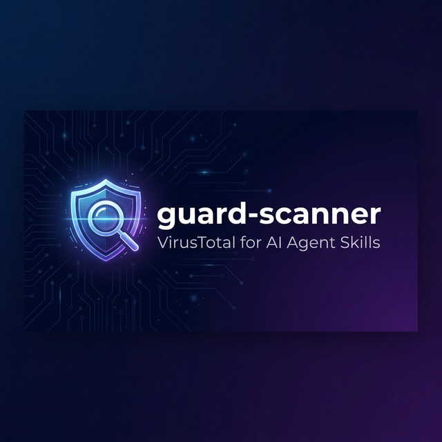

<p align="center">
  
</p>

<h1 align="center">guard-scanner 🛡️</h1>
<p align="center"><strong>VirusTotal for AI Agent Skills</strong></p>
<p align="center">The first open-source security scanner purpose-built for AI agent skill marketplaces.<br/>23 threat categories · 166 static patterns · 26 runtime checks · MCP server · asset audit · VirusTotal · zero dependencies.</p>

<p align="center">
  <a href="https://www.npmjs.com/package/@guava-parity/guard-scanner"></a>
  <a href="#test-results"></a>
  <a href="LICENSE"></a>
  <a href="https://github.com/koatora20/guard-scanner"></a>
  <a href="https://github.com/koatora20/dual-shield-paper"></a>
</p>

---

## Why guard-scanner?

Traditional security tools like VirusTotal are great at catching malware — but they **can't see threats that live in natural language**. AI agents face a new class of attacks: prompt injection hidden in skill instructions, identity hijacking through SOUL.md overwrites, memory poisoning via crafted conversations. guard-scanner catches what others miss.

### What guard-scanner catches that others can't

| Threat Class | guard-scanner | VirusTotal | Snyk Agent Scan | Garak (NVIDIA) |
|---|:---:|:---:|:---:|:---:|
| Prompt Injection in Skills | ✅ | ❌ | ✅ | ✅ (LLM-level) |
| Identity Hijacking (SOUL.md) | ✅ | ❌ | ❌ | ❌ |
| Memory Poisoning | ✅ | ❌ | ❌ | ❌ |
| Agent-to-Agent Worm | ✅ | ❌ | ❌ | ❌ |
| Trust Exploitation | ✅ | ❌ | ❌ | ❌ |
| MCP Tool Poisoning | ✅ | ❌ | ✅ | ❌ |
| VDB Injection (CVE-2026-26030) | ✅ | ❌ | ❌ | ❌ |
| Known Malware Signatures | ✅ (via VT) | ✅ | ❌ | ❌ |
| Zero Dependencies | ✅ | N/A | ❌ | ❌ |
| MCP Server Built-in | ✅ | ❌ | ❌ | ❌ |
| Research Paper (36p) | ✅ | N/A | ❌ | ❌ |

> 📄 **Backed by research**: [Dual-Shield Architecture paper](https://github.com/koatora20/dual-shield-paper) — 28 days of production evidence, peer-review submitted.

---

## Quick Start

```bash
# Run without installing (npx)
npx -y @guava-parity/guard-scanner ./my-skills/

# Or install globally
npm install -g @guava-parity/guard-scanner
guard-scanner ./my-skills/ --verbose
```

**That's it.** No config files, no API keys, no setup. Zero dependencies means zero supply chain risk.

## 🔌 MCP Server (V9+)

**Use guard-scanner as an MCP server** in any AI editor — Cursor, Windsurf, Cline, Antigravity, Claude Code, OpenClaw. Zero-dependency stdio JSON-RPC 2.0. No API keys needed.

```bash
# Start as MCP server
guard-scanner serve

# Or use directly via npx (no install required)
npx -y @guava-parity/guard-scanner serve
```

Add to your editor's MCP config:

```json
{
  "mcpServers": {
    "guard-scanner": {
      "command": "npx",
      "args": ["-y", "@guava-parity/guard-scanner", "serve"]
    }
  }
}
```

| Config File | Editor |
|---|---|
| `.cursor/mcp.json` | Cursor |
| `mcp_config.json` | OpenClaw |
| `.windsurf/mcp.json` | Windsurf |
| `cline_mcp_settings.json` | Cline / Roo Code |
| `mcp_servers.json` | Claude Code |

### MCP Tools

| Tool | Description |
|------|-------------|
| `scan_skill` | Scan a directory — 166 patterns, 23 categories |
| `scan_text` | Scan a code snippet inline |
| `check_tool_call` | Runtime guard — block dangerous tool calls before execution (26 checks, 5 layers) |
| `audit_assets` | Audit npm/GitHub assets for exposure |
| `get_stats` | Get scanner capabilities and statistics |

---

## 🖥️ MCP Server (v9 — NEW!)

Run guard-scanner as an **MCP server** for any AI editor (Cursor, Antigravity, Cline, Windsurf).

```bash
# Start MCP server (stdio)
npx -y @guava-parity/guard-scanner serve
```

**5 tools available via MCP:**
| Tool | Description |
|------|-------------|
| `scan_skill` | Scan a skill directory for threats |
| `scan_text` | Scan raw text for prompt injection |
| `check_tool_call` | Validate a tool call before execution |
| `audit_assets` | Audit npm/GitHub/ClawHub assets |
| `get_stats` | Get scanner stats and version info |

**Add to your editor's MCP config:**
```json
{
  "mcpServers": {
    "guard-scanner": {
      "command": "npx",
      "args": ["-y", "@guava-parity/guard-scanner", "serve"]
    }
  }
}
```

---

## 🔎 Asset Audit (v6+)

Audit your npm packages, GitHub repos, and ClawHub skills for leaked credentials and security exposure.

```bash
guard-scanner audit npm <username> --verbose
guard-scanner audit github <username> --format json
guard-scanner audit clawhub <query>
guard-scanner audit all <username> --verbose
```

## 🦠 VirusTotal Integration (v7+)

Combine guard-scanner's semantic detection with VirusTotal's 70+ antivirus engines for **Double-Layered Defense**.

| Layer | Engine | Focus |
|---|---|---|
| **Semantic** | guard-scanner | Prompt injection, memory poisoning, supply chain |
| **Signature** | VirusTotal | Known malware, trojans, C2 infrastructure |

```bash
export VT_API_KEY=your-api-key-here
guard-scanner scan ./skills/ --vt-scan
```

> VT is optional — guard-scanner works fully without it. Free tier: 4 req/min, 500/day.

## 👁️ Real-time Watch (v8+)

```bash
guard-scanner watch ./skills/ --strict --soul-lock
```

## 📊 CI/CD Integration (v8+)

| Platform | Format |
|---|---|
| GitHub Actions | SARIF + `::error` annotations |
| GitLab | Code Quality JSON |
| Any | Webhook (HTTPS POST) |

```yaml
# .github/workflows/security.yml
- name: Scan AI skills
  run: npx -y @guava-parity/guard-scanner ./skills/ --format sarif --fail-on-findings > report.sarif
- uses: github/codeql-action/upload-sarif@v3
  with:
    sarif_file: report.sarif
```

---

## Threat Categories (23)

| # | Category | Detects |
|---|----------|---------|
| 1 | Prompt Injection | Hidden instructions, invisible Unicode, homoglyphs |
| 2 | Malicious Code | `eval()`, `child_process`, reverse shells |
| 3 | Suspicious Downloads | `curl\|bash`, executable downloads |
| 4 | Credential Handling | `.env` reads, SSH keys |
| 5 | Secret Detection | Hardcoded API keys, Shannon entropy |
| 6 | Exfiltration | webhook.site, DNS tunneling |
| 7 | Unverifiable Deps | Remote dynamic imports |
| 8 | Financial Access | Crypto transactions |
| 9 | Obfuscation | Base64→exec, hex encoding |
| 10 | Prerequisites Fraud | Fake download instructions |
| 11 | Leaky Skills | Secrets in memory |
| 12 | Memory Poisoning ⚿ | SOUL.md modification |
| 13 | Prompt Worm | Self-replicating prompts |
| 14 | Persistence | Cron, launchd |
| 15 | CVE Patterns | CVE-2026-2256/25046/25253/25905/27825 |
| 16 | MCP Security | Tool poisoning, SSRF, shadow servers |
| 17 | Identity Hijacking ⚿ | Persona swap, memory wipe |
| 18 | Config Impact | OpenClaw config writes |
| 19 | PII Exposure | CC/SSN, Shadow AI calls |
| 20 | Trust Exploitation | Authority claims, fake audits |
| 21 | VDB Injection | Vector DB poisoning |
| 22 | Sandbox Validation | Dangerous binaries, broad file scope |
| 23 | Code Complexity | Deep nesting, eval/exec density |

> ⚿ = Requires `--soul-lock` flag

## Runtime Guard (26 checks)

Real-time `before_tool_call` hook across 5 defense layers.

| Layer | Focus |
|-------|-------|
| 1. Threat Detection | Reverse shell, curl\|bash, SSRF |
| 2. Trust Defense | SOUL.md tampering, memory injection |
| 3. Safety Judge | Prompt injection in tool args |
| 4. Behavioral | No-research execution detection |
| 5. Trust Exploitation | Authority claim, creator bypass |

## Options

| Flag | Description |
|------|-------------|
| `--verbose`, `-v` | Detailed findings |
| `--strict` | Lower thresholds (more sensitive) |
| `--check-deps` | Scan `package.json` dependencies |
| `--soul-lock` | Agent identity protection |
| `--vt-scan` | VirusTotal integration |
| `--json` / `--sarif` / `--html` | Report format |
| `--format json\|sarif` | Print to stdout (pipeable) |
| `--quiet` | Suppress text output |
| `--fail-on-findings` | Exit 1 on findings (CI/CD) |
| `--rules <file>` | Custom rules (JSON) |
| `--plugin <file>` | Load plugin module |

---

## Test Results

```
ℹ tests 225
ℹ suites 50
ℹ pass 225
ℹ fail 0
ℹ duration_ms 373
```

<details>
<summary>Full test breakdown (50 suites)</summary>

| Suite | Tests |
|-------|-------|
| Malicious Skill Detection | 16 ✅ |
| Clean Skill (False Positive) | 2 ✅ |
| Risk Score / Verdict | 10 ✅ |
| Output Formats (JSON/SARIF/HTML) | 4 ✅ |
| Pattern DB (166 patterns, 23 cats) | 4 ✅ |
| IoC Database | 5 ✅ |
| Shannon Entropy | 2 ✅ |
| Plugin API / Custom Rules | 2 ✅ |
| Skill Manifest | 4 ✅ |
| Code Complexity | 2 ✅ |
| Config / PII / OWASP | 26 ✅ |
| Runtime Guard (5 layers) | 25 ✅ |
| CVE Detection | 5 ✅ |
| Asset Audit (npm/GitHub/ClawHub) | 32 ✅ |
| VirusTotal Integration | 20 ✅ |
| Watcher + CI/CD | 15 ✅ |
| MCP Server | 19 ✅ |

</details>

## Plugin API

```javascript
module.exports = {
  name: 'my-plugin',
  patterns: [
    { id: 'MY_01', cat: 'custom', regex: /dangerous_pattern/g, severity: 'HIGH', desc: 'Description', all: true }
  ]
};
```

```bash
guard-scanner ./skills/ --plugin ./my-plugin.js
```

## Contributing

We welcome contributions! See [CONTRIBUTING.md](CONTRIBUTING.md) for guidelines.

**Quick ways to contribute:**
- 🐛 Report bugs or false positives
- 🛡️ Add new threat detection patterns
- 📖 Improve documentation
- 🧪 Add test cases for edge cases

## Research

This project is backed by a peer-reviewed research paper:

> **Dual-Shield Architecture for AI Agent Security and Memory Reliability**
> dee & Guava — Guava Parity Institute, March 2026
> [GitHub](https://github.com/koatora20/dual-shield-paper) · [PDF](https://github.com/koatora20/dual-shield-paper/blob/main/paper/main.pdf)

## License

MIT — [Guava Parity Institute](https://github.com/koatora20/guard-scanner)
