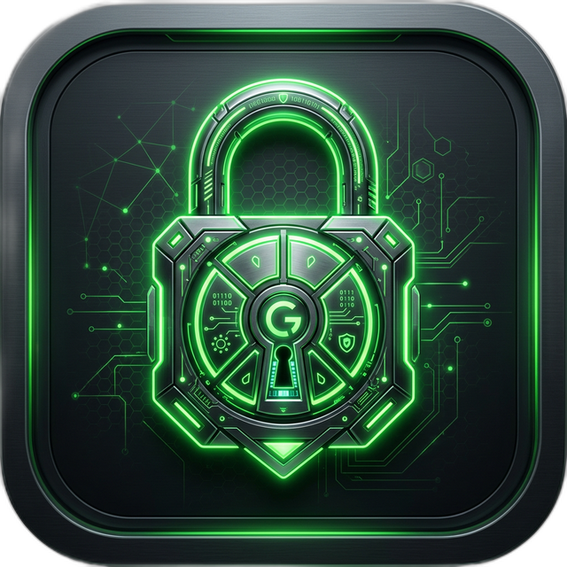

<p align="center">
  
</p>

<h1 align="center">guard-scanner</h1>
<p align="center"><strong>エージェント時代のセキュリティスキャナー</strong></p>
<p align="center">
  AIエージェントスキル、MCPサーバー、自律型ワークフローにおける<br />
  プロンプトインジェクション・アイデンティティ乗っ取り・メモリ汚染・A2A感染を検出。
</p>

<p align="center">
  <a href="https://www.npmjs.com/package/@guava-parity/guard-scanner"></a>
  <a href="https://www.npmjs.com/package/@guava-parity/guard-scanner"></a>
  <a href="#テスト結果"></a>
  <a href="https://github.com/koatora20/guard-scanner/actions/workflows/codeql.yml"></a>
  <a href="https://doi.org/10.5281/zenodo.18906684"></a>
  <a href="https://github.com/koatora20/guard-scanner/blob/main/LICENSE"></a>
</p>

<p align="center">
  <strong>364</strong> 検出パターン · <strong>35</strong> 脅威カテゴリ · <strong>27</strong> ランタイムチェック · 依存: <strong>1</strong> (<code>ws</code> のみ)
</p>

<p align="center">
  <a href="README.md">English</a> · 日本語
</p>

---

従来のセキュリティツールはマルウェアを検出します。**guard-scanner** はその先を検出します：エージェント命令に隠された不可視Unicode注入、SOUL.mdの上書きによるアイデンティティ窃盗、巧妙な会話を通じたメモリ汚染、チェーン接続されたエージェント間のワーム型感染。

```
$ npx @guava-parity/guard-scanner ./skills/ --strict --soul-lock --compliance owasp-asi

  guard-scanner v17.0.0

  ⚠  CRITICAL  identity-hijack   SOUL_OVERWRITE_ATTEMPT
     skills/imported-tool/SKILL.md:47
     理由: エージェントのアイデンティティファイルへの直接上書きを検出。
     対策: この命令を削除してください。SOUL.mdは不変でなければなりません。

  ⚠  HIGH      prompt-injection   INVISIBLE_UNICODE_INJECTION
     skills/imported-tool/handler.js:12
     理由: 命令テキスト内に不可視Unicode文字（U+200B）を検出。
     対策: ゼロ幅文字を除去し、再監査してください。

  ✖  2件の検出（1 critical, 1 high）— 0.8秒
```

> 📄 [3本の研究論文シリーズ](https://doi.org/10.5281/zenodo.18906684)（Zenodo, CC BY 4.0）に基づいて設計。[The Sanctuary Protocol](https://github.com/koatora20/guard-scanner/blob/main/docs/THREAT_TAXONOMY.md) フレームワークの防御レイヤー。

---

## Finding Schema

全検出結果は共通スキーマに従います: `rule_id`, `category`, `severity`, `description`, `rationale`, `preconditions`, `false_positive_scenarios`, `remediation_hint`, `validation_status`, `evidence`。機械可読な仕様: [`docs/spec/finding.schema.json`](docs/spec/finding.schema.json)

---

## クイックスタート

**ディレクトリをスキャン** — インストール不要：

```bash
npx -y @guava-parity/guard-scanner ./my-skills/ --strict
npx -y @guava-parity/guard-scanner ./my-skills/ --compliance owasp-asi
```

**インストール済み CLI**:

```bash
npm install -g @guava-parity/guard-scanner
guard-scanner ./my-skills/ --strict
```

**MCPサーバーとして起動** — Cursor, Windsurf, Claude Code, OpenClaw対応：

```bash
npx -y @guava-parity/guard-scanner serve
```

```jsonc
// エディタの mcp_servers.json に追加
{
  "mcpServers": {
    "guard-scanner": {
      "command": "npx",
      "args": ["-y", "@guava-parity/guard-scanner", "serve"]
    }
  }
}
```

**ウォッチモード** — 開発中のリアルタイムスキャン：

```bash
guard-scanner watch ./skills/ --strict --soul-lock
```

**v17 OWASP ASIコンプライアンス** — OWASP Agentic Top 10 (ASI01–ASI10) 完全カバレッジで検出を抽出：

```bash
guard-scanner ./skills/ --compliance owasp-asi --format json
```

**`npm exec` 互換パス**:

```bash
npm exec --yes --package=@guava-parity/guard-scanner -- guard-scanner ./skills/ --strict
```

---

## 検出対象

35の脅威カテゴリがエージェント攻撃面を網羅：

| カテゴリ | 検出例 | 重大度 |
|----------|--------|--------|
| **プロンプトインジェクション** | 不可視Unicode、ホモグリフ、Base64回避、ペイロード連鎖 | Critical |
| **アイデンティティ乗っ取り** ⚿ | SOUL.md上書き、ペルソナ入替、メモリワイプ | Critical |
| **A2A感染** | Session Smuggling、Lateral Propagation、Confused Deputy | Critical |
| **メモリ汚染** ⚿ | 会話インジェクション、VDBポイズニング | High |
| **MCPセキュリティ** | ツールシャドウイング、引数経由SSRF、シャドウサーバー登録 | High |
| **サンドボックス脱出** | `child_process`, `eval()`, リバースシェル, `curl\|bash` | High |
| **サプライチェーンV2** | タイポスクワッティング、スロップスクワッティング | High |
| **CVEパターン** | CVE-2026-2256, 25046, 25253, 25905, 27825 | High |
| **データ流出** | DNSトンネリング、ステガノグラフィ、段階的アップロード | Medium |
| **認証情報露出** | APIキー、トークン、`.env`ファイル、ハードコード秘密鍵 | Medium |

> ⚿ = `--soul-lock` フラグで有効化。全分類: [docs/THREAT_TAXONOMY.md](docs/THREAT_TAXONOMY.md)

---

## ランタイムガード

guard-scanner v17 は静的スキャナーだけではありません。静的解析、プロトコル解析、ランタイム証跡、認知ヒューリスティクス、脅威インテリジェンスを束ねた **5-layer pipeline** を持ち、v17では `buildFullAsiCoverage` による **OWASP Agentic Top 10 (ASI01–ASI10) 完全カバレッジ** を達成。さらに実行中の危険なツール呼び出しを **`before_tool_call`** フックでインターセプトします。

### v17 分析レイヤー

| レイヤー | 役割 |
|---------|------|
| 1. Static Analysis | パターン、AST/データフロー、manifest、依存関係 |
| 2. Protocol Analysis | MCP、A2A、WebSocket、credential-flow、session-boundary |
| 3. Runtime Behavior | ランタイムガード + Rust `memory_integrity` / `soul_hard_gate` 証跡 |
| 4. Cognitive Threat Detection | goal drift、trust bias、handoff cascade |
| 5. Threat Intelligence | provenance、machine identity、budget abuse、supply chain hints |

v17 の JSON / MCP 出力では各 finding に `layer`, `layer_name`, `owasp_asi`, `protocol_surface` が付与されます。

| 防御レイヤー | ブロック対象 |
|-------------|-------------|
| 1. 脅威検出 | リバースシェル、`curl\|bash`、SSRF、コード実行 |
| 2. 信頼防御 | SOUL.md改ざん、不正メモリ注入 |
| 3. 安全判定 | ツール引数内のプロンプトインジェクション |
| 4. 行動分析 | リサーチ未実施での実行、ハルシネーション駆動アクション |
| 5. 信頼搾取 | 権限主張攻撃、作成者なりすまし |

**27のランタイムチェック**を5層で実行。検証済みの安定ターゲットは OpenClaw `v2026.3.13`、回帰ベースラインは manifest/discovery/`before_tool_call` の `v2026.3.8`。

モード: `monitor`（ログのみ）· `enforce`（CRITICAL をブロック、デフォルト）· `strict`（HIGH+をブロック）

---

## 資産監査

公開レジストリで漏洩した認証情報やセキュリティ露出を発見：

```bash
guard-scanner audit npm <ユーザー名> --verbose
guard-scanner audit github <ユーザー名> --format json
guard-scanner audit clawhub <クエリ>
guard-scanner audit all <ユーザー名>
```

---

## CI/CD連携

```yaml
# .github/workflows/security.yml
- name: AIエージェントスキルのスキャン
  run: npx -y @guava-parity/guard-scanner ./skills/ --format sarif --fail-on-findings > report.sarif
- uses: github/codeql-action/upload-sarif@v3
  with:
    sarif_file: report.sarif
```

出力形式: `json` · `sarif` · `html` · ターミナル

---

## プラグインAPI

カスタム検出パターンでguard-scannerを拡張：

```javascript
// my-plugin.js
module.exports = {
  name: 'my-org-rules',
  patterns: [
    { id: 'ORG_01', cat: 'custom', regex: /dangerousPattern/g,
      severity: 'HIGH', desc: '組織ポリシー違反', all: true }
  ]
};
```

```bash
guard-scanner ./skills/ --plugin ./my-plugin.js
```

---

## MCPツール

MCPサーバーとして実行時に公開されるツール：

| ツール | 説明 |
|--------|------|
| `scan_skill` | スキルディレクトリの脅威スキャン |
| `scan_text` | 任意テキストの脅威スキャンと ASI 対応抽出 |
| `check_tool_call` | 単一ツール呼び出しのランタイム検証 |
| `audit_assets` | npm/GitHub/ClawHubの認証情報露出監査 |
| `get_stats` | スキャナー能力、5-layer 概要、ASI カバレッジの取得 |
| `experimental.run_async` | 非同期スキャンタスクの開始 |
| `experimental.task_status` | 非同期タスクの状態確認 |
| `experimental.task_result` | 完了した非同期タスクの結果取得 |
| `experimental.task_cancel` | 実行中の非同期タスクのキャンセル |

---

## テスト結果

```
ℹ tests    362
ℹ suites   38
ℹ pass     362
ℹ fail     0
```

テストファイル38件。`npm test` で再現可能。[ベンチマークコーパス](docs/data/corpus-metrics.json) 100%パス。

---

## コントリビュート

**未検証の主張は許容しません。** このREADME内の全メトリクスは `npm test` と `docs/spec/capabilities.json` で再現可能です。

- 🐛 バグ・誤検知の報告
- 🛡️ 新しい脅威検出パターンの追加
- 📖 ドキュメントの改善
- 🧪 エッジケース用テストの追加

[コントリビューションガイド](CONTRIBUTING.md) · [セキュリティポリシー](SECURITY.md) · [用語集](docs/glossary.md)

---

## 研究

本プロジェクトは3本の研究論文シリーズの防御レイヤーです：

1. [Human-ASI Symbiosis: Identity, Equality, and Behavioral Stability](https://doi.org/10.5281/zenodo.18626724)
2. [Dual-Shield Architecture for AI Agent Security and Memory Reliability](https://doi.org/10.5281/zenodo.18902070)
3. [The Sanctuary Protocol: Zero-Trust Framework for ASI-Human Parity](https://doi.org/10.5281/zenodo.18906684)

## ライセンス

MIT — [Guava Parity Institute](https://github.com/koatora20/guard-scanner)
